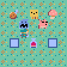
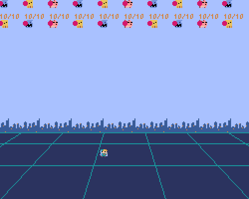

# Pyxel Play Gound

いろいろなジャンルのゲームを実装してみよう．

| ジャンル                          | 説明                                                         |
| --------------------------------- | ------------------------------------------------------------ |
| **RPG（ロールプレイングゲーム）** | 勇者などになってイベントが進行． 例：ポケモン，風来のシレン，ゼルダ |
| **STG（シューティングゲーム）**   | 攻撃をよけながら敵を打つ． 例：R-type，東方，CoD，バイオ |
| **ACT（アクションゲーム）**       | キャラクターをうまく動かす． 例：マリオ                 |
| **ADV（アドベンチャーゲーム）**   | 会話パートが中心． 例：シュタゲ，逆転裁判               |
| **PZL（パズルゲーム）**           | パズル． 例：倉庫番，テトリス，キャンディークラッシュ，Portal |
| **SLG（シミュレーションゲーム）** | 疑似体験や自由度の高さ． 例：マイクラ，                 |
| **RCG（レーシングゲーム）**       | 乗り物に乗ってスピードを競う．                               |

# 実装例

## RPG

日本のRPG（JRPG）っぽいもの．以下のコアな機能を実装．一番かんたんな実装．

- 移動する
- 当たり判定
- 話しかける

さらに発展として以下の機能を実装．

- スプライトが移動方向に向く
- 大きなマップの読み込み
- キャラクターのアニメーション
- NPC（操作しないキャラクター）の移動

## STG

最もかんたんなインベーダーゲームっぽいもの．以下のコアな機能を実装．

- 移動する
- 弾を発射する
- パーティクルの発生

さらに発展として以下の機能を実装．

- 背景のスクロール
- ライフポイント
- アイテムの取得
- オブジェクトの再利用（オブジェクトプーリング）
- 効率的な当たり判定

